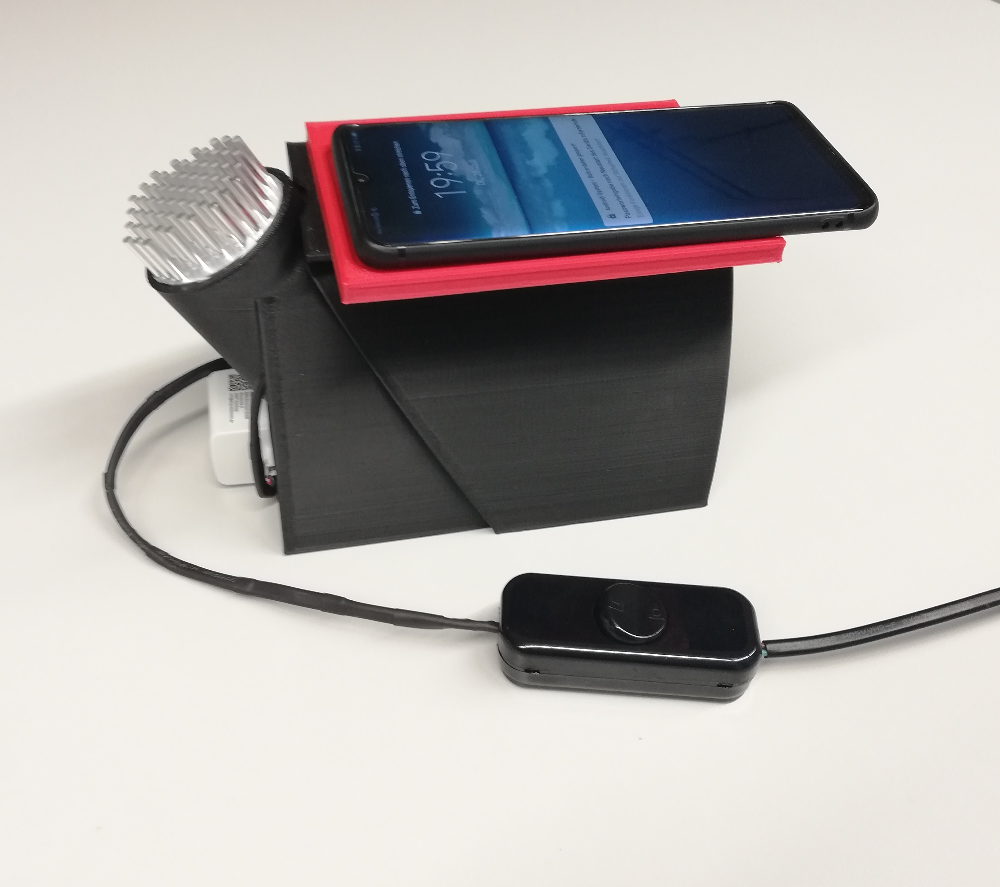
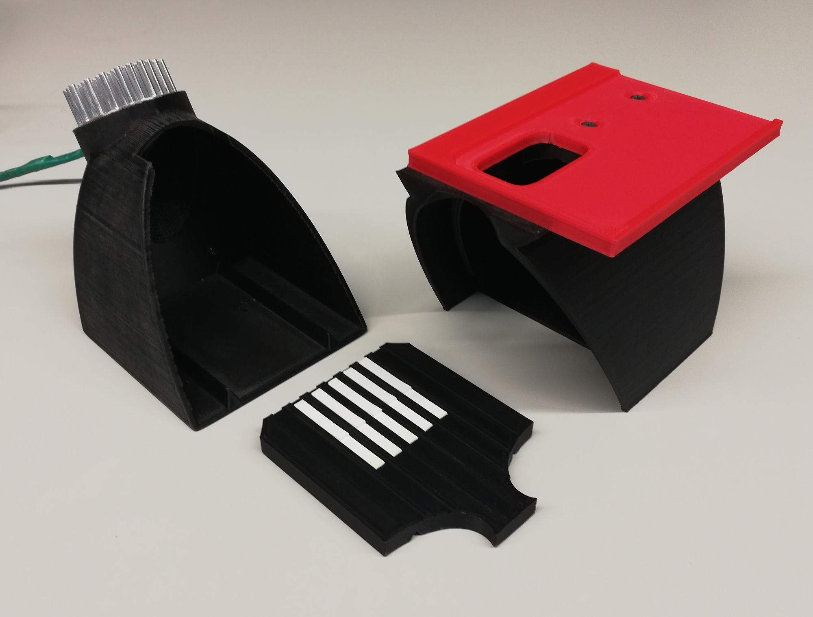

# Fotobox by Christoph Ruppert (christoph.ruppert@googlemail.com)

For more details see also the Electronic Supporting Material of 
Mahmoud et al. (2021) (https://doi.org/10.1016/j.snb.2020.129246).

Our fotobox consists of four parts:

1) Bottom (105 x 133 x 117 mm) -> Bottom.stl

2) Lid (110 x 140 x 112 mm) -> Lid.stl

3) Sample plate for up to 7 LFAs (90 x 110 x 10 mm) -> SamplePlate.stl

4) Adapter for Huawei P30 Pro (97 x 133 x 8 mm) -> P30Adapter.stl

We plan to add adapters for other smartphones in the future.

The 3D-printed parts were produced with an Ultimaker 3 3D-printer at 0.2mm
layer height resolution in black and red PLA.

