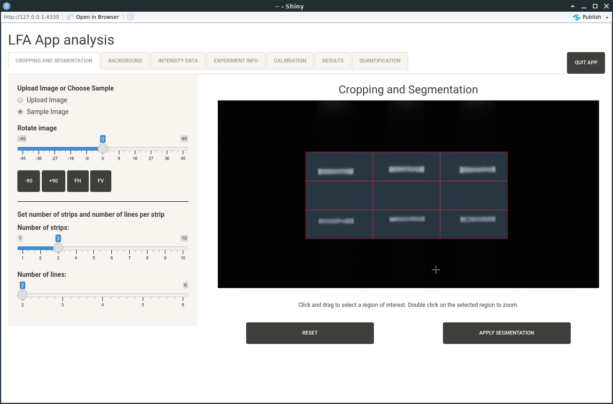

#  LFApp: Shiny Apps for Lateral Flow Assays

The repository includes the development version of R package LFApp

[](https://www.gnu.org/licenses/lgpl-3.0)
[](https://www.repostatus.org/#active)


## Description

The LFA shiny apps include in package LFApp consist of four modular Shiny 
applications: 

(1) **LFA App core** for image acquisition, editing, region of interest definition 
via gridding, background correction with multiple available methods, as well as 
intensity data extraction of the pre-defined bands of the analysed LFAs. More
precisely, it consists of Tab 1, Tab 2 and parts of Tab 3 described in detail 
below.

(2) **LFA App calibration** extends the LFA App core by methods for merging the
intensity data with information from experiments, computation of calibration 
models and the generation of a report about the calibration analysis. The 
functionality corresponds to the Tabs 1-6 described below.

(3) **LFA App quantification** enables quantification of the extracted intensity 
values via loading existing calibration models. It extends the LFA App core
by Tab 7 described below.

(4) **LFA App analysis** includes the full functionality mentioned above and 
enables full analysis in one application. That is, it consists of Tab 1-7.


The graphical user interface of the apps is built in a modular way divided into 
several tabs, where each tab represents a specific step of the workflow. While 
the applications can be used in a sequential fashion, the specific steps can 
also be carried out individually. 




## Testing our apps: shinyapps.io

Our apps can also be tested on shinyapps.io. The desktop version of our full
purpose analysis app is at

https://lfapp.shinyapps.io/LFAnalysis/

The mobile version is at

https://lfapp.shinyapps.io/mobile_app/


## Installation

The package requires Bioconductor package EBImage, which should be installed
first via

```{r}
## Install package BiocManager
if(!requireNamespace("BiocManager", quietly = TRUE)) 
  install.packages("BiocManager")
## Use BiocManager to install EBImage
BiocManager::install("EBImage", update = FALSE)
```

Our package depends on the most recent version of package shinyMobile, which 
must be installed from github (https://github.com/RinteRface/shinyMobile) by

```{r}
## Install package remotes
if(!requireNamespace("remotes", quietly = TRUE)) 
  install.packages("remotes")
## Install package shinyMobile
remotes::install_github("RinteRface/shinyMobile")
```

For generating our vignette and automatic reports, we need packages knitr and
rmarkdown, which will be installed next.

```{r}
## Install package knitr
if(!requireNamespace("knitr", quietly = TRUE)) 
  install.packages("knitr")
## Install package rmarkdown
if(!requireNamespace("rmarkdown", quietly = TRUE)) 
  install.packages("rmarkdown")
```

Finally, one can install package LFApp, where all remaining dependencies will
be installed automatically.

```{r}
## Install package LFApp
remotes::install_github("fpaskali/LFApp", build_vignette=TRUE)
```

## Start Apps
LFApp consist of four different shiny apps where there is a desktop and a 
mobile version for each app. They can be started with one of the following 
commands: 

```{r}
## desktop versions
## LFA App core
LFApp::run_core()

## LFA App quantification
LFApp::run_quan()

## LFA App calibration
LFApp::run_cal()

## LFA App full analysis
LFApp::run_analysis()

## mobile versions
## LFA App core
LFApp::run_mobile_core()

## LFA App quantification
LFApp::run_mobile_quan()

## LFA App calibration
LFApp::run_mobile_cal()

## LFA App full analysis
LFApp::run_mobile_analysis()
```

## Open User's Guide

A comprehensive user's guide is included in our package in form of a so-called
vignette and can be opened via

```{r}
vignette("LFApp")
```

You can also find it at https://fpaskali.github.io/LFApp/
