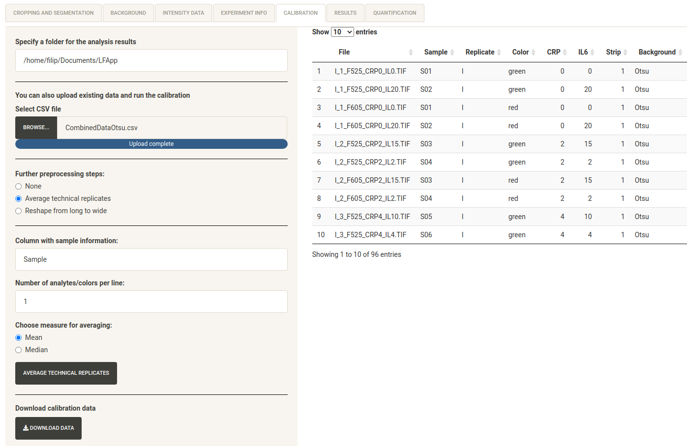
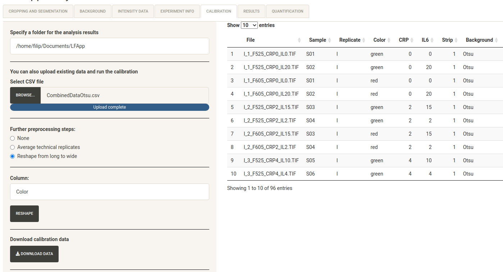
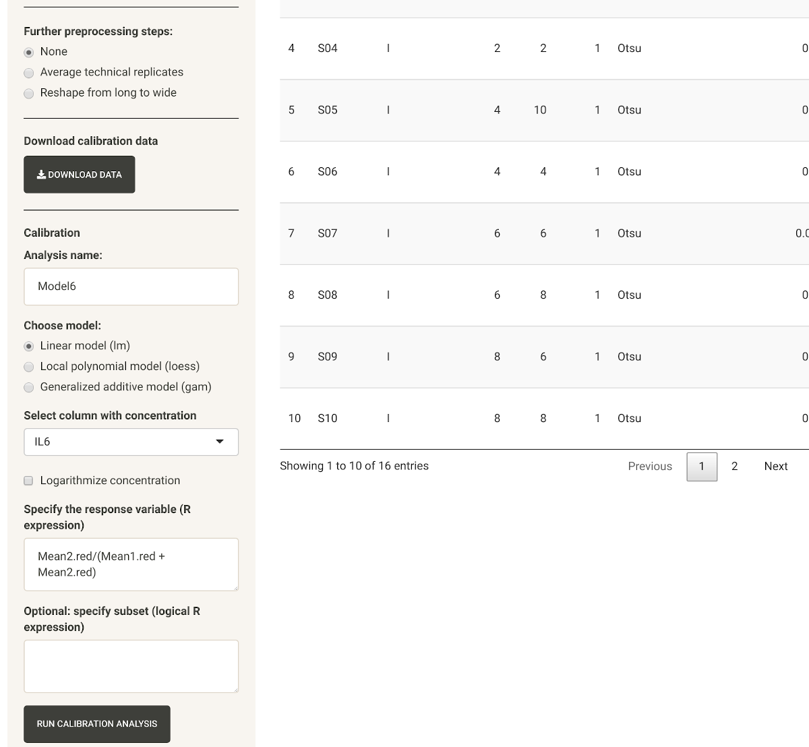
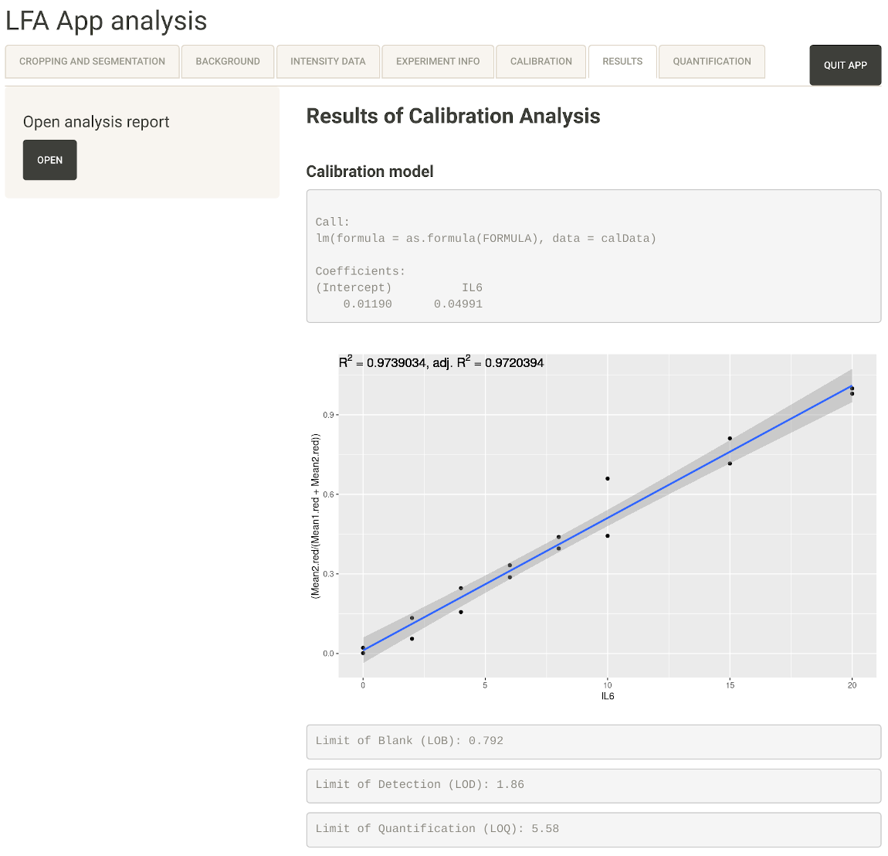
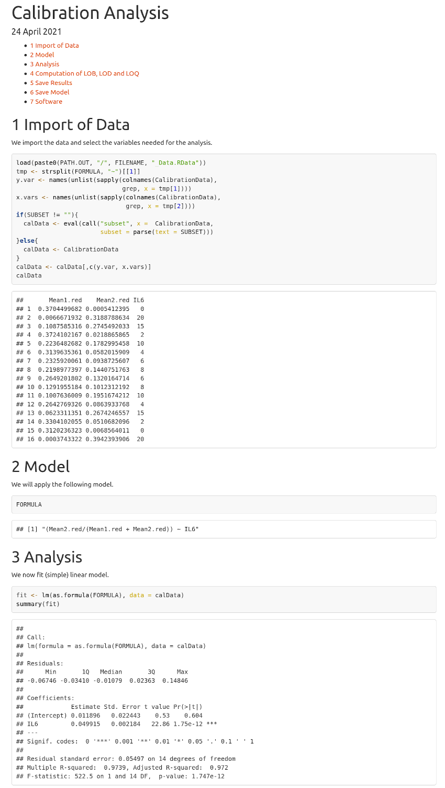

# Introduction
The LFA shiny apps [@Shiny2020] consist of four modular Shiny applications: (1) LFA App core for image acquisition, editing, region of interest definition via gridding, background correction with multiple available methods, as well as intensity data extraction of the pre-defined bands of the analysed LFAs. (2) LFA App calibration, which also includes tools for data processing, adding additional information and calibration functionality. (3) LFA App quantification, which enables quantification of the extracted intensity values via loading existing calibration models and (4) LFA App Analysis, which includes all the modules mentioned above and enables full analysis in one application.

The graphical user interface of the apps is built in a modular setup divided in several tabs, where each tab represents a specific step of the workflow. While the applications can be used in a sequential fashion, the specific steps can be carried out individually. 

# Tab 1: Cropping and Segmentation

## 1) Upload Image or Choose Sample Image

The first step consists of loading an image of one or several lateral flow strips. 
For trying out the app one can also load a sample image provided with the package.
For the purpose of demonstration we use the sample image provided with the package.
The image can be rotated or flipped horizontally and vertically via the rotation panel on the side. It can also be cropped to a specific size via double click on the interactive plot.

## 2) Set number of strips and number of lines per strip

In the next step, one needs to select the number of strips shown in the image and the number of lines (bands) per strip.

The maximum number of strips per image is 10, but in principle could be extended to a higher number. The only requirements is that the strips are regularly spaced
with identical or at least similar spaces between them and between the lines. 
The minimum number of lines per strip is two, the maximum number of lines per strip is six since we are not aware of any lateral flow assay having more than six lines.

## 3) Apply Segmentation

After loading the image and selecting the number of strips as well as lines per strip, one needs to click on the image and drag to generate a rectangular selection region on the image. It is best, if each line is roughly in the middle of a respective segment. In addition, there is a segment between two consecutive bands. This segment should not include any part of a line since it can be used for background correction; see below. An example of a
well selected cropping region is shown in the following screenshot. 

{width=100%}

By clicking "APPLY SEGMENTATION" the original image is cropped to size of the selected region and segmented. The segments between the bands are used in our quantile background correction method; see below.
An example can be seen in the screenshot below. If you want to change the cropped region you can select "RESET". 

The cropping was adapted from the shiny app provided by package ShinyImage [@shinyImage].

# Tab 2: Background

## 1) Select Strip

If there is more than one strip on the analysed image, one first needs to select, which strip shall be analysed.

## Optional: in case of color images

If the image is a color image, it will be transformed to grayscale. By default,
we apply the luminance approach, which converts color to grayscale preserving
luminance; that is, the grayscale values are obtained by 

$$
  0.2126 * R + 0.7152 * G + 0.0722 * B
$$
where R, G, B stands for the red, green and blue channel of the color image. 
By selecting mode "gray", the arithmetic mean of the RGB values is used. 
Furthermore, the selection of mode "red", "green" or "blue" allows a color 
channel wise analysis of color images.

## 2) Select threshold method and apply

There are four threshold methods, where the default is Otsu's method [@Otsu.1979].
Otsu's method returns a single intensity threshold that separates pixels into foreground and background. It is equivalent to k-means clustering of the intensity histogram [@Liu.2009]. Otsu and Li [@Li.1993, @Li.1998] are non-parametric, fully automatic algorithms that find the optimal threshold for the image. 
Additionally, two semi-automatic algorithms, namely Quantile and Triangle [@Zack.1977] were included, to cover different images and cases where automatic threshold results are not ideal. 
The quantile method is a simple method that computes the specified quantile of all pixel intensities of the segments between the lines (per strip). In most of the images we have analysed so far, Otsu's method performed very well and better than our quantile method. 
However, in cases where the lines are not unclear and very blurred our quantile method may outperform Otsu's method.

By clicking "APPLY TRESHOLD" the selected threshold method is applied to the segmented images of the selected strip. The upper plots show the pixels that have intensities above the background.
The lower plots show the images after background subtraction; see the screenshot below.

{width=100%}

The calculated mean and median intensities on the lines in order from top of the strip to the bottom of the strip are shown as well.

## 3) Add to data and go back to 1) or proceed with 4)

Clicking "ADD TO DATA" adds the mean and median of the background subtracted intensities of the pixels with intensities above the threshold to the data.
Now, one can proceed with the second strip of the image, use a different color conversion mode or go back to Tab 1 and load the next image. When all strips 
and images are processed one can proceed with 4). 

## 4) Switch To Intensity Data

Clicking "SWITCH TO INTENSITY DATA" changes the Tab to Tab 3.

# Tab 3: Intensity Data

Here, the latest version of the generated intensity data is shown in the Tab.

## Download data

By clicking "DOWNLOAD DATA" the data can be saved as a standard csv file. 

## Restart with new data

We also provide a "DELETE DATA" button for restarting with new images or uploading an already existing dataset. 

## Upload existing data

Instead of generating new data, one can also upload already existing intensity data, that can also be generated with a different software. This step can also be seen as a second entry point of the app. The screenshot below shows an example of data that was generated with the app saved and then loaded again.

{width=100%}

## 3) Switch To Experiment Info

Clicking "SWITCH TO EXPERIMENT INFO" changes the Tab to Tab 4, where information about the experiment can be loaded.

## Tab 4: Experiment Info

## 1) Upload Experiment Info or upload existing merged data and go to 5)

One first can either upload information about the experiment in form of a .csv file or upload already merged data (intensity data merged with experiment
information). An example of a table with information about the experiment is shown in the screenshot below.

{width=100%}

This is a third optional starting point of the app. Here, one can also directly start with already merged data and proceed with the calibration analysis.

## 2) Select ID columns and merge datasets

For merging the intensity data with the information about the experiment, one has to specify the names of the columns on which the merge should take place. 
The default is "File", as a "File" column is generated when the intensity data is computed with the app. By clicking "2) MERGE WITH INTENSITY DATA" the two datasets will be merged. An example of a table with merged data is shown in the screenshot below.

{width=100%}

## Download data

The merged data can be downloaded as a .csv file by clicking "DOWNLOAD DATA".

## Restart with new data

We again provide a "DELETE DATA" button for restarting with new images, uploading new intensity data on Tab 3 or uploading an already existing merged dataset.

## 5) Prepare Calibration

Clicking "PREPARE CALIBRATION" changes the Tab to Tab 5, where the data can be further preprocessed and the calibration analysis can be started.

# Tab 5: Calibration

## 1) Select a folder for the analysis results

In the first step, a folder for the analysis results can be selected. If no folder is specified, a new folder "LFApp" will be generated in the home directory of the user. 

## 2) Upload existing preprocessed data

Instead of generating the preprocessed data with our app, one can also upload preprocessed data and perform the calibration analysis on them. An example of uploaded preprocessed data that were generated with our app and saved as a .csv file is shown in the following screenshot.

## Optional: average technical replicates

If the merged data includes technical replicates, these replicates can be averaged either by the arithmetic mean or the median. For this purpose the name of the column, which enables the identification of the replicates is 
required. By default we assume that this column is called "Sample". In case there is more than one analyte/color per line, one should set "Number of analytes/colors per line" to the respective number. If this number is larger than 1, an additional field will be shown, where one should enter the name of the column including the analyte/color information.

{width=100%}

## Optional: reshape data from long to wide

If there is more than one analyte/color per line, one might want to combine both information into one calibration model. For such cases it is useful to reshape the data from long (analyte/color data in the rows) to wide (analyte/color data in the columns).

{width=100%}

## 4) Download preprocessed data

By clicking "DOWNLOAD DATA", the preprocessed data can be downloaded as .csv file.

## 5) Calibration by linear, local polynomial or generalized additive model

In the final step of this Tab, one has to specify the calibration model. 
The model can the chosen via a checkbox (linear, local polynomial LOES, generalized additive model GAM). A column for concentration values can be selected. The concentration values can be logarithmized. You can specify a response variable or specify a subset with valid R expressions.
An example is visible in the following screenshot.

{width=100%}

Sometimes one only wants to analyse a subset of the data. In such cases the
subset can be provided in terms of a logical R expression in the field below
"Optional: specify subset (logical R expression)". 

By pressing "RUN CALIBRATION ANALYSIS" the RData-file "CalibrationData.RData"
will be generated and saved in the specified analysis folder. Next, the R markdown
file "CalibrationAnalysis.Rmd" will be copied to the same folder and will be
rendered into file "CalibrationAnalysis.html" by using R package "rmarkdown"
[@rmarkdown]. The results of the calibration analysis will be saved in 
file "CalibrationResults.RData" and will be used to generated a brief overview
of the results that will be shown on Tab 6. All four files will remain in the
folder selected for the analysis results. That is, one may use and modify 
these files for an extended analysis.

# Tab 6: Results

This Tab shows a brief overview of the analysis results as 
shown in the following screenshot.

{width=100%}

## Open analysis report

By clicking "Open" the full report of the calibration analysis will be opened
in the standard browser. The first part of the report is visible in the following
screenshot.

{width=100%}

# Tab 7: Quantification

The final tab of our application enables the quantification of intensity values with the help of a calibration model.
You can upload an existing model from previous calibration analysis and use it to predict the concentrations for the intensity values acquired beforehand by clicking "PREDICT"
Via the "DOWNLOAD DATA" button the data table can be saved as a .csv file containing the intensity values as well as the predicted concentrations.

{width=100%}

# Required R packages

Our app requires the following R packages to work properly:

* stats: The R Stats Package [@R2020]
* mgcv: Mixed GAM Computation Vehicle with Automatic Smoothness Estimation [@mgcv]
* shiny: Web Application Framework for R [@Shiny2020]
* shinyjs: Easily Improve the User Experience of Your Shiny Apps in Seconds [@shinyjs.2020]
* shinythemes: Themes for Shiny [@shinythemes.2018]
* fs: Cross-Platform File System Operations Based on 'libuv' [@fs.2020]
* shinyFiles: A Server-Side File System Viewer for Shiny [@shinyfiles.2020]
* Bioconductor package EBImage: R package for image processing with applications to cellular phenotypes [@Pau.2010]
* DT: A Wrapper of the JavaScript Library 'DataTables' [@DT.2020]
* rmarkdown: Dynamic Documents for R [@rmarkdown]
* ggplot2: Elegant Graphics for Data Analysis [@Wickham.2016]

# References